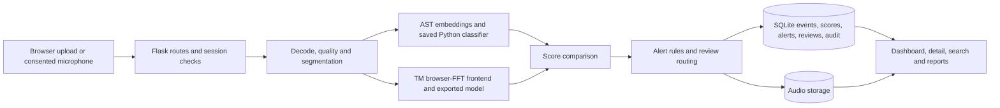

# Architecture

SonicSentinel is a Flask app on a single machine. Pages are rendered on the server with
Jinja, with a few small JavaScript files in the browser. SQLite holds users, model versions,
events, scores, alerts, reviews, live sessions and audit records. Audio files are stored in
a separate folder and the database keeps their relative paths. Thresholds, alert rules and
retention are JSON files in `config/` and `alert_rules/`.

`src/app.py` sets up the database engine, sessions, config store and blueprints.
`src/api/audio_api.py` and `src/api/live_api.py` handle the requests and permissions, then
call `src/services/pipeline.py`. The pipeline runs both models on the same decoded audio,
and neither model sees the other's result. `src/inference/consistency.py` compares the two
outputs, and `src/services/persistence.py` saves the event, both score lists, the audio
record, any alert or review, and an audit entry. Dashboards, event pages, reports and
exports only read these rows; they never run the models again.

After the user gives consent, the live page sends WAV windows to
`/api/live/sessions/<id>/windows`. Each window is stored with its event ID so a live
result can be traced back. The "N detections in a row" counter is kept in memory, so the
app runs as a single process (one gunicorn worker with threads). Running several workers
would mean moving that state to shared storage.

Login uses Flask-Login. Permissions are checked on the server by capability, and
state-changing requests need a CSRF token. With `SST_PRODUCTION=1` the app requires a real
secret key and secure cookies, so run it behind HTTPS. Normal users only see their own
events; reviewers, operators, maintenance staff and administrators get more. File paths
from the database are resolved inside the storage folder, so they can't point anywhere
else. The seeded accounts are for local demos only.

Both models are required. If the TM export is missing, analysis is switched off rather
than faking a second opinion. `gtm_model/metadata.json` has the label order, and the
TF.js export is converted for use on the server. Its spectrogram has to match Teachable
Machine's browser FFT exactly. The predictor has a `frontend_verified` flag that stays
false until server and browser predictions have been compared on the same clips. The TM
workflow is described in [the GTM handoff notes](gtm_model/upload_package/README.md).

Retention is run by hand through the admin API. It previews what would go, skips flagged
files, open alerts and pending reviews, deletes eligible audio, clears the stored path and
removes expired events. Batch size and retention periods are in
`alert_rules/retention.json`. There is no scheduler in the repo, even though that file
suggests a schedule.
