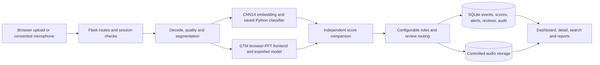

# Architecture

SonicSentinel is a single-node Flask application with server-rendered Jinja pages and small browser-side JavaScript modules. SQLite stores users, model versions, events, scores, alerts, reviews, live sessions and audit records. Audio bytes are stored under a separate filesystem root and referenced by relative path. JSON files in `config/` and `alert_rules/` govern thresholds, rule decisions and retention.

`src/app.py` initializes the engine, session factory, configuration store and blueprints. `src/api/audio_api.py` and `src/api/live_api.py` handle transport/authorization and call `src/services/pipeline.py`. The pipeline invokes both predictors on the same decoded audio without passing either model's result to the other. `src/inference/consistency.py` compares their outputs. `src/services/persistence.py` writes the analysis, both class distributions, audio record, possible alert/review, and audit entry. Dashboard, event, report and export routes read those rows; they do not rerun inference.

The browser microphone sends WAV windows to `/api/live/sessions/<id>/windows` after an explicit consent acknowledgement. The server records each window and its event ID so a live result can be traced back to its source. Repeated detections use a rolling state and per-class rule counts. For a multi-worker deployment, that in-memory confirmation state would need to move to shared storage; the current design is intended for a single process/node demonstration.

Session authentication uses Flask-Login with server-side capability checks and cookie CSRF tokens on state-changing requests. Production mode (`SST_PRODUCTION=1`) requires a configured secret and secure cookies; deploy behind HTTPS. Normal users see only their own event rows; reviewer, operator, maintenance and administrator capabilities gate wider actions. Files are resolved inside the configured storage root, so database paths cannot request arbitrary files. The seed credentials are for local demonstration only.

The models are operational dependencies. A missing GTM export disables dual-model analysis instead of inventing a second prediction. `gtm_model/metadata.json` gives label order; the exported TF.js network is converted for server inference. Its preprocessing must match Teachable Machine's browser FFT, including shape and normalization. The adapter reports an explicit `frontend_verified` flag; that flag must remain false until browser/server agreement is measured. [GTM handoff](gtm_model/upload_package/README.md) records the import/export flow, and verification evidence belongs in `gtm_model/frontend_verification.json` and `gtm_model/gtm_metrics.json` only after actual measurement.

Retention is manual from the admin API. It previews eligible rows, respects flagged files and open alerts/pending reviews, removes eligible audio bytes, blanks their stored path, and deletes expired event rows. The batch size and days come from `alert_rules/retention.json`. There is no cron scheduler in the repository despite the suggested schedule in that policy file.
