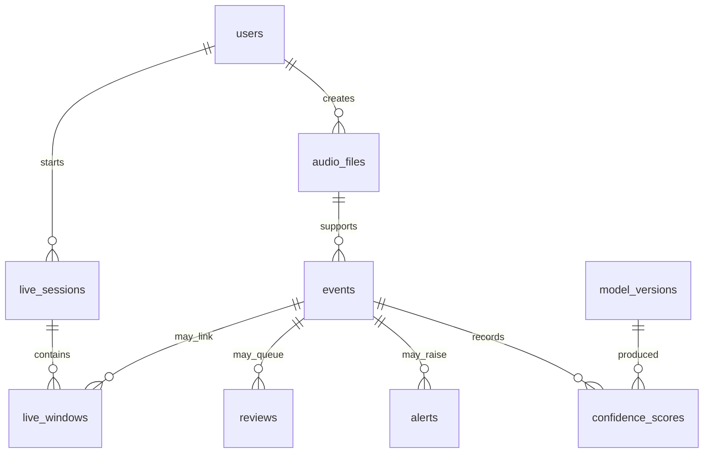

# Database schema

The runtime schema is declared by SQLAlchemy in `src/models.py`; `database/schema.sql` is a reference snapshot. SQLite is the default engine. `src/db.py` creates the database and demo seed accounts on first boot. The SQLAlchemy models, rather than this document, define exact column types and constraints.

| Table | Purpose and key fields |
|---|---|
| `users` | Unique username/email, hashed password, role, lockout and session-related fields |
| `audio_files` | Human-readable audio ID, SHA-256 unique constraint, perceptual fingerprint, relative storage path, format/length, source, consent, retention and investigation flag |
| `model_versions` | Python/GTM name and version, artifact reference, training metadata and active state; `(model_name, version)` is unique |
| `events` | One analysis decision with source, status, predicted/final class, severity, quality, consistency, version IDs, rule snapshot and timestamps |
| `confidence_scores` | Every class score for each model and event, rank/top flag and latency; `(event_id, model_name, class_name)` is unique |
| `alerts` | Event-linked severity, rule snapshot, status, acknowledgement/resolution and false-alarm evidence |
| `reviews` | Event-linked queue reason, priority, reviewer decision, comments and final class/severity |
| `live_sessions` | Consent, owner, status, start/end time and window/alert counts |
| `live_windows` | Session sequence, capture/result metadata, confirmation count and linked event/audio IDs; `(session_id, seq)` is unique |
| `audit_records` | Actor snapshot, action, target, outcome, before/after, IP and request ID; preserved independently of a user account |

Indexes cover audio hashes, event search/status/review routing, confidence tops, alert/review queues, session sequences and audit lookup. Event children use ORM delete-orphan cascades for scores, alerts and reviews. A retained audio metadata row can have an empty `stored_path` after byte retention; its historical event and hash remain queryable until their own retention period expires. An open alert, pending review or investigation flag holds evidence from purge.

Sample data is seeded from `database/seed_credentials.json` for accounts only. Real events arise from uploads or live windows; dashboards should not treat seed accounts as sample detections. Do not put the local SQLite file or private audio into a public repository.
