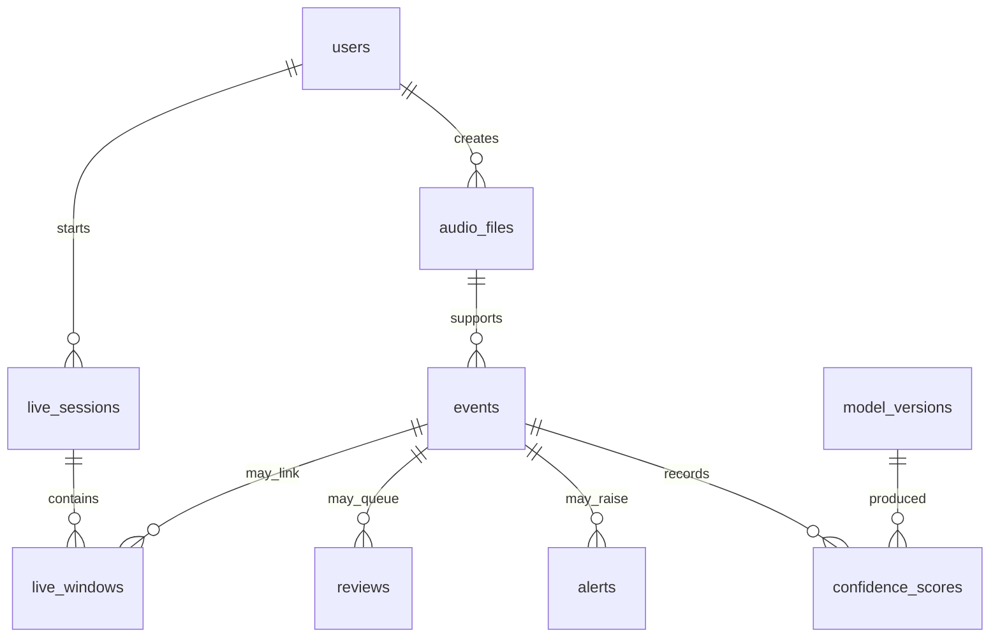

# Database schema

The schema is defined with SQLAlchemy in `src/models.py`, and `database/schema.sql` is a
generated copy for reading. SQLite is the default engine. The app creates any missing
tables when it starts; `database/init_db.py` also adds the demo accounts and registers the
trained models. For exact column types and constraints, read `src/models.py`.

| Table | What it holds |
|---|---|
| `users` | Unique username and email, password hash, role, lockout and session fields |
| `audio_files` | Readable audio ID, unique SHA-256, perceptual fingerprint, relative storage path, format and length, source, consent, retention date and investigation flag |
| `model_versions` | Python or TM model name and version, artifact path, training metadata and whether it is active; `(model_name, version)` is unique |
| `events` | One analysis: source, status, predicted and final class, severity, quality, consistency, model version IDs, rule snapshot and timestamps |
| `confidence_scores` | Every class score from each model for each event, with rank, top flag and latency; `(event_id, model_name, class_name)` is unique |
| `alerts` | Severity, rule snapshot, status, acknowledgement or resolution, and false-alarm details, linked to an event |
| `reviews` | Why the event was queued, priority, the reviewer's decision, comments and final class/severity |
| `live_sessions` | Consent, owner, status, start and end time, window and alert counts |
| `live_windows` | Sequence number, capture and result details, confirmation count and linked event/audio IDs; `(session_id, seq)` is unique |
| `audit_records` | Copy of the actor's name and role, action, target, outcome, before/after, IP and request ID; kept even if the user is deleted |

There are indexes for audio hashes, event search, status and review routing, top scores,
alert and review queues, session sequences and audit lookups. Deleting an event also
deletes its scores, alerts and reviews. When retention removes an audio file, its row
stays with an empty `stored_path`, and the event and hash remain searchable until their
own retention period ends. An open alert, a pending review or an investigation flag keeps
the audio from being purged.

The only seed data is the accounts in `database/seed_credentials.json`. Events only come
from uploads and live windows. Don't put the local SQLite file or private audio in a public
repository.
