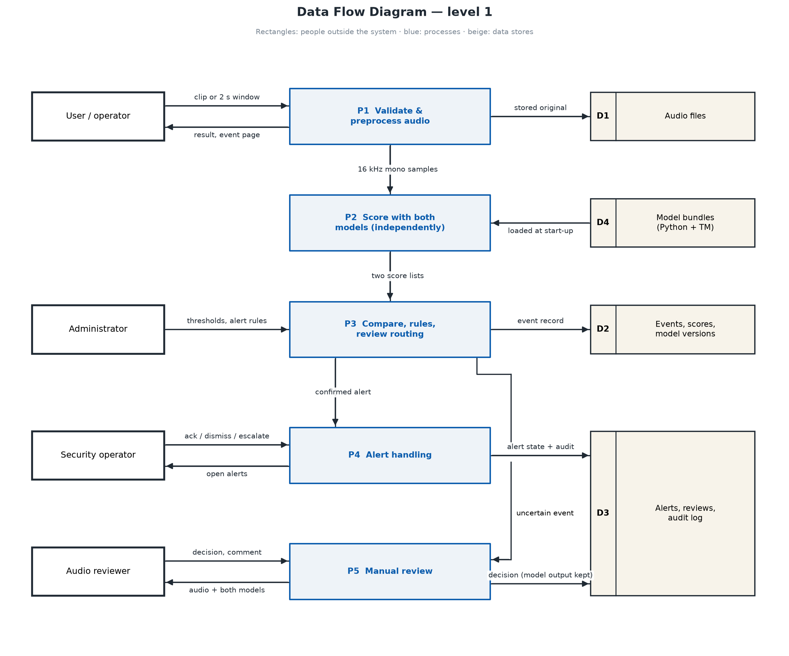
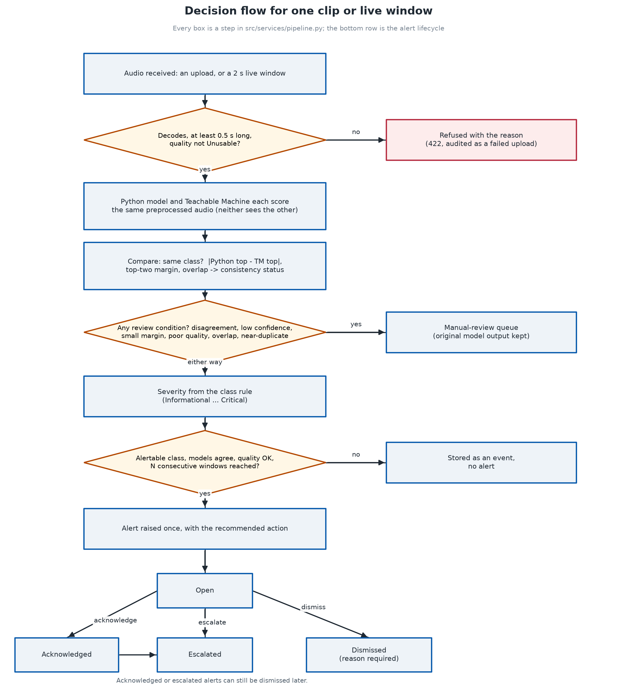
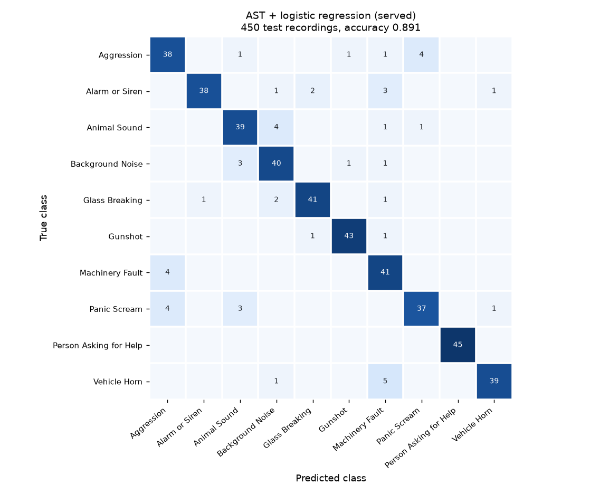

# SonicSentinel AI — project report

Aptech TechWiz 7 · NextWave AI and ML · SRS v1.0. Team, roll numbers and task allotment:
see §9 (to be completed by the team).

Numbers in this report are copied from files in the repository, named next to each one.
Where a target is not met, the report says so.

## 1. Problem, background and necessity

Sites such as factories, transport hubs and public buildings produce sounds that
matter: a machine starting to fail, breaking glass, a gunshot, a scream, a call for help.
Today someone has to be listening at the right moment or search recordings afterwards,
which is slow, inconsistent and easy to miss in noise. SonicSentinel AI analyses uploaded
recordings and consented live microphone audio, classifies them into ten sound
categories, and helps an operator decide what needs attention.

## 2. Proposed solution, purpose and scope

A Flask web application in which every clip or two-second live window is validated,
rated for quality, preprocessed, and scored independently by two models: a Python
classifier trained by us and a Google Teachable Machine (TM) audio model. The app compares
the two, applies configurable alert rules with repeated-detection confirmation, raises
alerts for critical classes, sends uncertain results to a review queue, and keeps the
evidence (audio, both score lists, versions, decisions, audit trail) for search, analytics
and reports. Five roles use it: normal user, audio reviewer, security operator,
maintenance operator and administrator.

**In scope:** everything in SRS §1.6. **Out of scope:** acting as a certified emergency or
law-enforcement system, automatic dispatch, and any generative-AI decision.

**Assumptions:** a supervised operator is present; recordings are made with consent; one
server process (the repeated-detection state is per process); FFmpeg is installed.

**Constraints (SRS §1.5):** audio quality, noise, distance, device and overlapping events
vary; accuracy depends on the dataset; the two models may disagree; privacy and consent;
bias across speakers and devices. Our own constraints: a laptop CPU (4 cores, 15 GB RAM, no
usable GPU for training), freely licensed audio only, five competition days.

## 3. Requirements

The functional (FR i–lxxx) and non-functional (NFR 1–5) requirements are traced one by
one, with the implementing file, the test or measurement, and the status, in
[documentation/SRS_TRACEABILITY.md](documentation/SRS_TRACEABILITY.md).

## 4. Architecture and modules

| Module | Responsibility |
|---|---|
| `src/app.py`, `src/auth.py`, `src/api/` | Flask app, sessions, CSRF, role checks, HTTP routes |
| `audio_preprocessing/` | decoding (FFmpeg), validation, quality verdict, high-pass, noise gate, trimming, normalisation, 16 kHz mono, segmentation |
| `feature_extraction/` | 254 hand-made features (baseline) and CNN14 embeddings (served model) |
| `python_models/` | training scripts, the served bundle `best/`, metrics |
| `gtm_model/`, `src/inference/gtm_predictor.py` | the TM export and its server-side frontend |
| `src/inference/consistency.py` | comparison of the two models |
| `src/services/pipeline.py` | the decision path for one clip or window |
| `alert_rules/`, `config/` | thresholds, per-class rules, retention, monitoring limits |
| `src/services/persistence.py`, `src/models.py` | database writes and schema |
| `src/services/monitoring.py` | FR lxxviii anomaly checks |
| `templates/`, `static/` | pages, live monitor, event player and visuals |

More detail: [ARCHITECTURE.md](ARCHITECTURE.md), [API_DOCUMENTATION.md](API_DOCUMENTATION.md).

### Diagrams

| Diagram | File |
|---|---|
| Data flow (level 1) | `diagrams/dfd.png` |
| Use case | `diagrams/use_case.png` |
| Activity | `diagrams/activity.png` |
| Sequence (upload) | `diagrams/sequence_upload.png` |
| Decision flow | `diagrams/decision_flow.png` |

All five are generated by `tools/render_uml.py` (which also checks that no box overlaps
another and no arrow passes through a box).

## 5. Database design and data dictionary

SQLite through SQLAlchemy; ten tables: users, audio_files, model_versions, events,
confidence_scores, alerts, reviews, live_sessions, live_windows, audit_records. Every event
links to its audio file and to the Python and TM model versions that produced it. Reviews
keep the original model outputs next to the reviewer's decision. Schema, keys and indexes:
[DATABASE_SCHEMA.md](DATABASE_SCHEMA.md). Dataset data dictionary:
[audio_dataset/DATA_DICTIONARY.md](audio_dataset/DATA_DICTIONARY.md).

## 6. Audio pipeline and decision rules

**Validation** (FR viii): format by decoding, not extension; size ≤ 50 MB; 0.5 s–5 min;
integrity; presence of sound. **Quality** (FR xii–xiv, xxxvii): silence, clipping, low
signal and an SNR estimate give Good, Acceptable, Poor or Unusable; Unusable is refused.
**Preprocessing** (FR xi): high-pass 50 Hz, spectral noise gate (strength 0.75), trim ends
at 30 dB below peak, normalise to −3 dBFS, resample to 16 kHz mono, 3 s segments with
timestamps. Training reads the output of this same object (`python_models/preprocess_cache.py`).

**Comparison** (FR xxxi–xxxix): class match, |Python top − TM top|, top-two margin for each
model, and a secondary class above 0.25 as a possible overlap, giving Strong Match,
Acceptable Match, Weak Match, Model Disagreement or Uncertain Result.

**Rules** (FR xl–liii): each class has a severity, recommended action and escalation in
`alert_rules/alert_rules.json`. A critical alert needs the class to be alertable, the models
to agree, quality at least Acceptable and, by default, three consecutive windows within 8 s;
it is raised once per confirmation. **Review** (FR lvii): disagreement, confidence below 0.6,
top-two margin below 0.15, poor quality, overlap, a possible near-duplicate or a critical
class without agreement.

## 7. Dataset

3,000 original recordings, 300 per class: ESC-50 (696), FSD50K (≈ 700), UrbanSound8K (387),
our synthetic help phrases (300) and procedurally generated Aggression/Panic clips (75).
Every row has an Audio ID, filename, class, source, licence, author, duration, sample rate,
channels, environment, device, distance where known, original/augmented status, parent ID
and SHA-256 (`audio_dataset/manifest.csv`). Licences: CC-BY-4.0, CC0, CC-BY-3.0, and 36
Sampling+ clips that need a redistribution check ([DATA_ATTRIBUTION.md](DATA_ATTRIBUTION.md)).

**Split:** 2,100 / 450 / 450, exactly 210 / 45 / 45 per class, assigned by *source
recording*: slices of one Freesound upload, and one synthetic voice saying one phrase, stay
together. The first split did not do this and leaked (125 uploads and 37 voice+phrase pairs
crossed partitions); it was replaced on 26 Sep and every model re-scored.

**Collection method and limits:** public, licensed collections mapped to our classes, plus
text-to-speech for the five SRS help phrases in 11 voices. Honest weaknesses: Aggression
includes door slams and thumps; Machinery Fault is normal machinery; Help is synthetic only;
2,123 rows have an unspecified environment.

**Augmentation** (FR xix): `augmentation/` implements noise (real background beds or
coloured noise), time shift, pitch shift, time stretch, volume, reverberation, distance and
device simulation. Copies are made from training recordings only, keep their parent's ID and
split, and are never counted as originals. The same functions produce the robustness probes.

## 8. Models

### 8.1 Python model

| Family | Test acc. | Macro F1 | Critical recall |
|---|---:|---:|---:|
| HistGradientBoosting, 254 features | 0.731 | 0.730 | 0.822 |
| CRNN on log-mel (old split) | 0.600 | 0.596 | 0.667 |
| CNN14 embeddings + MLP | 0.840 | 0.840 | 0.862 |
| CNN14 embeddings + logreg, +4,200 augmented train copies | 0.838 | 0.837 | 0.849 |
| **AST embeddings + logistic regression (served)** | **0.891** | **0.892** | **0.907** |

The served model is the Audio Spectrogram Transformer (AudioSet-pretrained, model card
`MIT/ast-finetuned-audioset-10-10-0.4593`, revision-pinned) with a logistic regression
head on its 2,063-d embedding. Selection on validation chose logreg `C 0.01`
(selection score 0.885). All families were fitted on train only and scored once on test.

Design, the validation grid, per-class precision/recall/F1, the confusion matrix and the
error analysis are in [documentation/MODEL_EVALUATION.md](documentation/MODEL_EVALUATION.md).
Feature descriptions are in `feature_extraction/features.py`; the served bundle records its
training-set hash, seed, selection criterion and pretrained checksum
(`python_models/best/model_meta.json`).

### 8.2 Teachable Machine model

A TM audio project with the ten SRS class names, trained from 1,400 one-second samples: 140
training recordings per class, taken in a fixed hash order so every source is represented, one
sample each (the loudest second after preprocessing, the same rule the server uses). 1,400 is
the most this browser's Teachable Machine would train without stalling. Exported as TensorFlow.js
and converted to Keras for the server, which averages the scores of every one-second window of a
clip weighted by energy (chosen on the validation split). Training configuration: TM defaults.
Evidence: `screenshots/gtm/`, `gtm_model/metadata.json`, `gtm_model/upload_package/tm_imports/index.json`,
`audio_dataset/gtm_samples/`.

Test result: **0.493 accuracy, 0.473 macro F1, 0.591 mean critical-class recall**
(`gtm_model/gtm_metrics.json`). History: the first export (32 samples per class, first second of
each clip) scored 0.278; a 1,400-sample export in audio-id order (mostly FSD50K clips) scored
0.462. The model stays far below the SRS targets; `documentation/MODEL_EVALUATION.md` explains
why and what we tried.

### 8.3 Prediction and confidence comparison

`reports/MODEL_COMPARISON.md` and `reports/model_comparison.csv` cover all 450 test recordings
with every SRS column: both predictions, all ten confidences for each model, class match, the
top-class confidence difference, top-two margins, quality, severity, alert status, review
status, final decision, correctness and an explanation of each disagreement.
**Summary across all 450 unseen test recordings.** The two models agreed on the predicted
class in 222 of 450 cases (49.3 %): 26 Strong Matches (5.8 %), 22 Acceptable Matches
(4.9 %) and 42 Weak Matches (9.3 %). They disagreed outright on 39 recordings (8.7 %),
and 321 recordings (71.3 %) fell to Uncertain Result — most often because the Teachable
Machine model is far less accurate than the Python model, which drags the top-class
confidence difference up. Where the models agree they are right 94.6 % of the time. The
comparison is genuinely useful as a result: 403 of 450 recordings (89.6 %) were routed to
the manual-review queue with a reason, and all 47 automatically decided recordings were
correct (100 %) versus 0.493 for the Teachable Machine model on its own. Where the two
models agree, they are right most of the time; where they disagree, the disagreement is
itself the safety-relevant signal, so it is escalated rather than averaged away.

## 9. Team and task allotment

To be completed by the team with real names and roll numbers (see
`documentation/VIVA_PACK.md` §1 for the module list).

| Member | Roll no. | Modules | Evidence |
|---|---|---|---|
| | | | |

## 10. Testing

`pytest` covers functional, integration (real Flask app and database), boundary, negative,
security (CSRF, roles, lockout), database (including 20,000 events), audio format, silence,
clipping, noise, preprocessing, feature extraction, both models, comparison, alert rules,
duplicates and near-duplicates, low confidence and overlap. Latest run and the case-by-case
plan: [TEST_PLAN.md](TEST_PLAN.md). Evidence beyond unit tests:

| Evidence | File |
|---|---|
| Both models on 450 unseen recordings | `reports/model_comparison.csv` |
| Noise, echo, low volume, device, distance, partial, overlap, re-encoding, confusables | `reports/ROBUSTNESS.md` |
| Latency against NFR 1 | `reports/performance.json` |
| Near-duplicate detection | `reports/near_duplicates.json` |
| Confidence threshold on validation | `reports/threshold_calibration.json` |
| UI at four widths | `reports/ui_review.json` |

### Noise robustness, false positives and false negatives

**How the two models degrade.** Python accuracy fell from 0.74 on the clean probe clips to
0.62 under 0 dB background noise, 0.55 at −30 dB volume, 0.53 at a simulated 20 m distance and
0.55 when two sounds overlap at −6 dB. Critical-class recall held up better than accuracy on
the quiet conditions (0.78 at −30 dB, 0.76 at 20 m) because a faint but recognisable critical
sound still outranks the alternatives. The Teachable Machine model started far lower (0.37
clean) and fell roughly in step, so the gap between the two models is consistent rather than
condition-specific. Background noise, distance and overlap are the real limits on detection
range, so the deployment guidance in the report states a quiet, indoor, close-microphone
operating envelope.

**Confusable and out-of-set sounds.** Sounds the models never trained on were never silently
accepted. Of 240 out-of-set clips (ESC-50 fireworks, door knocks, clapping, laughing, crying
babies, church bells), 230 (95.8 %) were routed to the manual-review queue and only 10 were
left as a confident critical alert without human confirmation. Crying babies were heard as
Panic Scream (35 of 40) and church bells as Alarm or Siren (32 of 40) — the intended critical
response to a sound in the same family — while door knocks and clapping were read as
Aggression, which is a false-alarm risk worth watching. This is the practical argument for the
dual-model comparison and the review queue: they are what keeps an out-of-set sound from
becoming a dispatched critical alert on its own.

False negatives on the clean test split: 9 of 45 Panic Screams were called Aggression; quiet
animal sounds were called Background Noise. False positives for critical classes come mostly
from the same voice confusion. 21 of 450 predictions were wrong at ≥ 0.9 confidence.

### Performance

Measured through the real HTTP routes with both real models (`tools/benchmark_latency.py`),
full timings in `reports/performance.json`. A 30 s upload — decoding, both models, the alert
rules and the database write — completes in a median **7.15 s** (p95 7.47 s) against the
SRS 8 s budget, and a 2 s live window in a median **2.06 s** (p95 2.30 s) against the 3 s
budget. Both targets are met. Four clients uploading at once degrades to a median 25.7 s,
which is the honest scaling limit of this single-process CPU-only deployment. The first
request after startup pays a one-time model-load cost (11.6 s), which is reported
separately as a cold start so it is not mistaken for steady-state latency; the app warms
both models at start-up (`AnalysisPipeline.warm()`), so this cost is paid at boot rather
than in the first user request.

## 11. Security and privacy

Hashed passwords with lockout after 5 failures; server-side role checks on every route; CSRF
tokens; security headers with a strict Content-Security-Policy; uploads validated by decoding;
stored audio served only through guarded routes and resolved inside the storage root; SHA-256
duplicate detection; spreadsheet-safe CSV export; audit log of logins, uploads, sessions,
predictions, alerts, reviews, overrides, exports and configuration changes; anomaly checks for
failed uploads, model failures, low-confidence spikes, alert bursts, duplicates and failed
logins. Privacy: microphone capture only after an explicit consent tick, a visible Active state
while recording, configurable retention with preview, and no audio leaves the server. No
secrets are committed; settings are in `.env` (template `.env.example`). Demo credentials are
published on purpose for evaluators and must be replaced before any public deployment.

## 12. Limitations and future work

- SRS-4: the served Python model reaches **0.891** test accuracy (target 0.85, met), macro
  F1 0.892 (target 0.80, met) and 0.907 critical recall (target 0.85, met); Aggression
  (0.84) and Panic Scream (0.82) are individually below 0.85 even though the mean clears
  it, and those two remain the honest weak point. The TM model is below target: see §8.2.
- Proxy labels for Aggression and Machinery Fault; synthetic-only help phrases.
- No "Unknown" class: out-of-set sounds are forced into the nearest class and rely on review.
- Browser/server parity of the TM frontend not measured.
- Single-process repeated-detection state; not load-tested; not deployed; no uptime figure.
- Trimmed re-uploads are recognised as near-duplicates only about 22 % of the time.

Next: record consented, purpose-made clips for the weak classes; add an "Unknown" class trained
on out-of-set sounds; fine-tune CNN14 on a GPU; move repeated-detection state to the database for
multiple workers; deploy with monitoring to measure availability.
